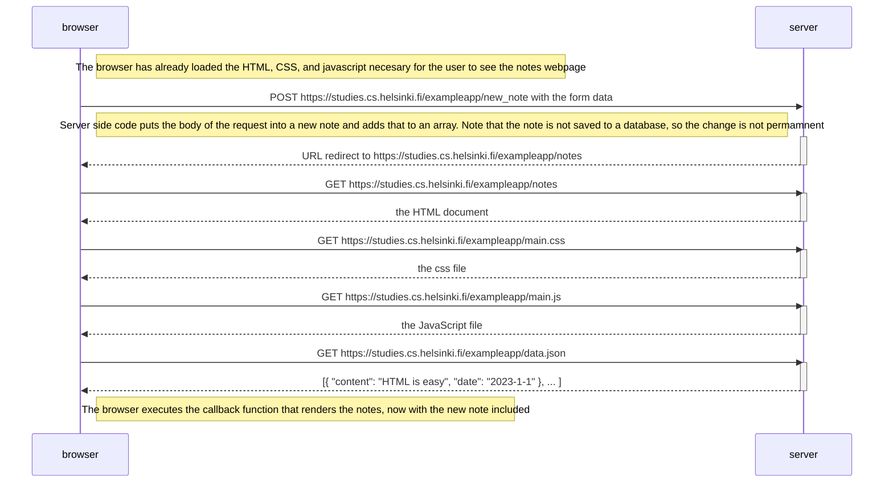

```mermaid
sequenceDiagram
    participant browser
    participant server

    Note right of browser: The browser has already loaded the HTML, CSS, and javascript necesary for the user to see the notes webpage

    browser->>server: POST https://studies.cs.helsinki.fi/exampleapp/new_note with the form data
    Note left of server: Server side code puts the body of the request into a new note and adds that to an array. Note that the note is not saved to a database, so the change is not permamnent
    activate server
    server-->>browser: URL redirect to https://studies.cs.helsinki.fi/exampleapp/notes
    deactivate server

    browser->>server: GET https://studies.cs.helsinki.fi/exampleapp/notes
    activate server
    server-->>browser: the HTML document
    deactivate server

    browser->>server: GET https://studies.cs.helsinki.fi/exampleapp/main.css
    activate server
    server-->>browser: the css file
    deactivate server

    browser->>server: GET https://studies.cs.helsinki.fi/exampleapp/main.js
    activate server
    server-->>browser: the JavaScript file
    deactivate server


    browser->>server: GET https://studies.cs.helsinki.fi/exampleapp/data.json
    activate server
    server-->>browser: [{ "content": "HTML is easy", "date": "2023-1-1" }, ... ]
    deactivate server

    Note right of browser: The browser executes the callback function that renders the notes, now with the new note included
```